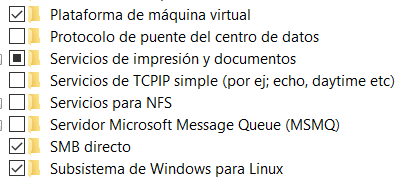
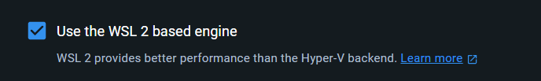
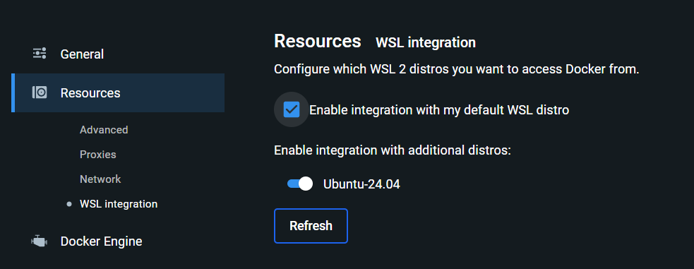

## Install sail docker
- Activa las opciones de windows plataforma de maquina virtual y subsstema 
    - Instala wsl y ejecuta (wsl --set-default-version 2) para cambiar y saber si se instalo wsl --install.
- asegurar que esta seleccionado 
- ver lista de distribuciones que se tiene con (wsl --list --online)
- Instalar una con por ejemplo (wsl --install -d Distrox).
- ahora activar en resources/wsl integration desde el docker descktop la distro instalado , despues comprobar usando (wsl --list --verbose)

## desplegarl proyect
- reinicie docker y vuelva a abrir la terminal
- estando en la termina de linux pegar la siguiente linea (curl -s "https://laravel.build/chirperRMV" | bash), este ultimo para crear un proyecto tal cual.